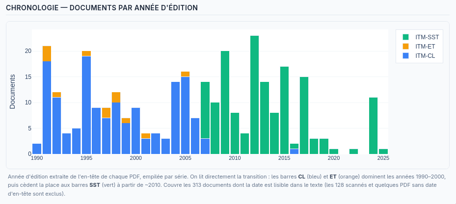

# Conflict Resolver Precedent Database

**Live demo:** [yannhoffmann.com/seco2](https://yannhoffmann.com/seco2) — AI detects contradictions between ITM regulations, with citations and expert resolution workflow

**Technical docs:** (ITM Corpus Explorer · costing analysis · LLM benchmark · test coverage): [yannhoffmann.com/secodoc](https://yannhoffmann.com/secodoc)

**Run locally:** `make app2` · `make test` · `make eval`

---

## Table of contents

- [🏗️ What problem, for who?](#what-problem-for-whom)
- [🗺️ Regulatory scope](#regulatory-scope)
- [🎯 Why is this relevant to SECO?](#why-is-this-relevant-to-seco)
- [📂 Data sources](#data-sources)
- [🔍 ITM Corpus Explorer](#itm-corpus-explorer)
- [⚙️ Technical decisions and trade-offs](#technical-decisions-and-trade-offs)
    - [🔗 Conflict Resolver architecture: pairwise document index](#conflict-resolver-architecture-pairwise-document-index)
    - [🧱 Pipeline structure & data flow](#pipeline-structure-data-flow)
    - [🛡️ AI robustness stack](#ai-robustness-stack)
    - [🎯 Evaluating detection quality (golden set)](#evaluating-detection-quality-golden-set)
    - [🧪 Code quality & test coverage](#code-quality-test-coverage)
    - [🔒 Data confidentiality and LLM deployment tiers](#data-confidentiality-and-llm-deployment-tiers)
    - [💰 API dependency and cost model](#api-dependency-and-cost-model)
- [🚀 What goes to production tomorrow vs. what gets thrown away?](#what-goes-to-production-tomorrow-vs-what-gets-thrown-away)
- [🔭 3-month vision](#3-month-vision)
- [🤖 A note on AI-assisted development](#a-note-on-ai-assisted-development)

---

## What problem, for who?

Construction projects in Luxembourg span a web of overlapping regulatory texts — ITM workplace safety prescriptions, PAG urban planning rules, European norms, communal supplements — written by different authorities at different dates and never cross-referenced. An architect designing to ITM-CL-55.2 may well miss that ITM-ET-32.10 says something different about the same installation.

The **Regulatory Conflict Resolver** directly addresses those specific pain points in an architect's workflow: surface contradictions early leveraging AI's breadth, give the architect a suggestion at design time, and let experts record their resolutions as **vetted precedents** that compounds in institutional value over time.


---

## Regulatory scope

A commercial building project in Luxembourg touches at least four distinct regulatory layers, each controlled by a different authority:

| Layer | Authority | Scope | Phase |
|---|---|---|---|
| European | CEN (Eurocodes), EU directives | Structural design, machinery, equipment (elevators → directive 95/16/CE) | Design |
| National | Grand-ducal regulations, ministerial arrêtés | Implementation of EU directives, national safety standards | Design / permit |
| Regulatory bodies | **ITM** (workplace safety), **CGDIS** (fire safety), Administration des Bâtiments Publics | Operational prescriptions, periodic inspections, authorizations | Construction / operation |
| Municipal | Commune, PAG, PAP, communal supplements | Zoning, land use, urban form | Permit |

The PoC intentionally restricts itself to the ITM layer. ITM is the primary regulatory interface for workplace and construction site safety in Luxembourg, and intra-ITM conflicts are already numerous enough to demonstrate the approach. In addition, that scope was validated by a domain practitioner on an actual project demonstrating the value of the application.

**Limitations:** although the dream would be a universal resolver that spans ITM × CGDIS × Eurocodes National Annexes × communal supplements — the current technology requires a significant amount of expert input that keeps on increasing the more domains are added. In other words, AI scales, expertise does not, and the ITM corpus strikes the right balance between value creation and feasibility.

---

## Why is this relevant to SECO?

SECO's core value is independent technical control. Its inspectors navigate the same regulatory web as architects, and a vetted precedent database is directly useful to them — a resolution documented by one SECO expert is available to every other. Surfacing conflicts at design stage also shortens the feedback loop for clients, which reflects well on the inspection process.

---

## Data sources

| Source | Used in | Why |
|---|---|---|
| 9 ITM PDFs across 3 clusters — lighting (CL-55.2, ET-32.10, CL-144.1), ventilation (CL-53.1, CL-62.1, CL-86.1), ascenseurs (CL-82.1, CL-83.1, CL-230.2) — ([ITM website](https://itm.public.lu)) | Conflict Resolver | Three expert-picked topic clusters with known intra-cluster overlaps to illustrate the problem |
| Full ITM corpus for exploration — 454 ITM-CL/ET/SST PDFs (scraped from [itm.public.lu](https://itm.public.lu)) | ITM Explorer | The complete public ITM prescription set; used to map the corpus and pick conflict clusters from evidence |

---

## ITM Corpus Explorer

The ITM Explorer was built in addition to the Conflict Resolver to have a better understanding of the corpus. It has surfaced insights about series (CL/ET/SST) clusters and overlap. 
If development continues, it would be a central tool for observability and debugging.

On the technical side: a cached pipeline scrapes itm.public.lu, downloads every French ITM-CL/ET/SST PDF, extracts text with pdfplumber, derives a short title per document via an LLM, embeds with OpenAI `text-embedding-3-small`, reduces to 2D with UMAP, and renders an interactive report (Plotly semantic map + a stacked documents-per-year histogram + sortable inventories).

**The corpus, quantified:**

| | Count | Note |
|---|---|---|
| Documents scraped | **454** | Full ITM-CL/ET/SST set, French only |
| Text-extractable → mapped | **326** | Embedded + positioned on the semantic map |
| Scanned (OCR backlog) | **128 (28%)** | No text layer — excluded from the map, listed separately |

**Two findings that feed straight back into the Conflict Resolver:**

1. **Three series, two eras.** ITM-CL (Conditions-types, per-equipment, ~1990–2016) and ITM-ET (Établissements-types, per-building-type, ~1991–2005) are the **legacy** series; ITM-SST (Sécurité-Santé au Travail, ~2007–2025) is the **modern unified** series absorbing both. The year histogram shows the handover directly (CL/ET bars give way to SST around 2010). This is the strongest argument yet for the Conflict Resolver's version-tracking: a 1990s CL prescription may be silently superseded by a recent SST text.

2. **The OCR gap is concentrated in the legacy series.** Of the 128 scanned documents, **101 are CL, 14 ET, 13 SST** — ~90% are the old CL/ET texts (over half the ET series is un-digitized), versus only 8% of the modern SST series. The gap isn't random; it sits exactly where the supersession risk is highest. That makes OCR a prioritized backlog, not a uniform chore.



---

## Technical decisions and trade-offs

### Conflict Resolver architecture: pairwise document index

The naive approach — dump all documents into one prompt — works for a handful of texts but breaks at scale: context grows as O(n), cost grows as O(n), and a single API failure invalidates everything.

The implemented model is a **cluster-aware pairwise matrix**. Documents are organized into topic subfolders (`documents/lighting/`, `documents/fire-safety/`, …). Only documents within the same cluster are ever compared — cross-topic pairs are never run. Each intra-cluster pair `(A, B)` is analyzed independently and cached by content fingerprint:

```
cache key = sha256(text_A)[:12] + "_" + sha256(text_B)[:12] + "_" + PROMPT_VERSION
```

For a corpus of N documents with average cluster size C:
- **Total pairs**: N × (C−1) / 2
- **New pairs when adding 1 document**: C−1 (constant, independent of N)

Adding a new lighting regulation to a 3-document cluster triggers 2 API calls, regardless of whether the total corpus contains 10 documents or 10,000. This bounds ingestion cost at O(C), not O(N). All existing pair results are cache hits; the merged conflict set is rebuilt from the pair cache with no API calls on warm restarts.

**Trade-off accepted:** pairwise analysis misses conflicts that only emerge from three-way interactions (A says X, B says Y, C resolves it). In practice those are rare within a single topic cluster and can be caught in a second-pass synthesis step if needed.

### Pipeline structure & data flow

The conflict pipeline is an **offline data pipeline** that produces a dataset; the FastAPI app is a **thin server** that reads it. They are deliberately separated — the API never calls the LLM on a warm path, and the pipeline has no web concerns:

```
documents/<cluster>/*.pdf
   │  pipeline.extract      PDF → structured text (per cluster), content-hashed
   ▼
data/extracted.json
   │  pipeline.analyze      pairwise LLM detection, cached per (hashA,hashB,prompt)
   ▼  ├─ pipeline.schema    Pydantic validation        ─┐
data/cache/<pair>.json      ├─ pipeline.grounding  quote check   ├─ robustness stack
   │                        ├─ pipeline.usage      cost ledger   ─┘
   ▼  merge + validate + ground
data/analysis.json  ──────►  main.py  ──►  GET /api/conflicts
```

Each module under `pipeline/` owns one concern (`config`, `schema`, `docs_meta`, `extract`, `grounding`, `usage`, `analyze`, `run`), so the robustness layers below are each a findable unit rather than buried in one file. All generated artifacts live under a single git-ignored `data/` directory, fully reproducible with `make analyze` (`python -m pipeline.run`). Adding a document or a whole cluster is a drop-in: put the PDF in a subfolder, optionally register metadata, re-run — only the new pairs hit the API.

### AI robustness stack

Every LLM call goes through four layers before its output is persisted:

**1. Structured output validation (Pydantic)**
The response is parsed against a strict schema (`Conflict`, `ConflictSource`). Required fields are enforced; `severity` is constrained to `critique | majeur | mineur`. Malformed conflicts are logged and dropped, not silently served. This prevents schema drift between prompt iterations from corrupting stored results.

**2. Quote grounding check**
Each cited quote is fuzzy-matched against the source document text (65% word-overlap threshold, accent-normalised). Conflicts where the quote cannot be located in the source are flagged `quote_verified: false` in the API response and shown with a warning badge in the UI. This catches hallucinated citations without discarding potentially valid conflicts.

**3. Retry with exponential backoff**
Every API call is wrapped in a 3-attempt retry loop (1 s → 2 s → 4 s) on `RateLimitError` and `InternalServerError`. Transient failures are logged; permanent failures surface as a 500 with the original error.

**4. Prompt versioning**
`PROMPT_VERSION` is embedded in the cache key. Bumping it (e.g. `v2 → v3`) automatically invalidates all pair caches on the next run without requiring a manual cache flush.

### Evaluating detection quality (golden set)

The four layers above protect *individual* calls. They don't tell you whether a prompt tweak or model swap quietly stopped finding a real conflict. That needs an **output-level regression gate** — `backend/eval/`.

`golden_set.json` pins a handful of human-verified lighting conflicts taken from the actual output: the 3-vs-6-month emergency-lighting maintenance cadence (the example in the intro above), the *blocs-autonomes vs source-centrale* power-source contradiction, the 10-vs-50/100 lux circulation levels. Each case asserts the pipeline keeps detecting it — correct **document pair**, enough **characteristic keywords**, and severity at or above a **floor**:

```
make eval        # → 5/5 golden conflicts detected, all quote-verified
```

Two deliberate choices: matching is **tolerant** (keyword subsets + a severity floor, not verbatim strings) so normal phrasing drift doesn't make it flaky, and it runs **offline against warm pair caches** (no API key, no spend) so it's safe in CI. Negative controls confirm it *fails* on the wrong pair, missing keywords, or a severity below floor — a gate that can't fail is theatre.

**Honest limit:** five cases on one cluster is a smoke test, not statistical coverage, and the matcher is a heuristic. The point is that the *harness* exists — scaling it to a labelled set with tracked precision/recall is the production step.

### Code quality & test coverage

Beyond the golden set, the pipeline and API carry a conventional offline test suite (schema validation, quote grounding, extraction, cost aggregation, cluster pairing, and the FastAPI endpoints via `TestClient`) — none of it needs an API key. Coverage is measured, not asserted:

```
make test        # pytest + coverage  → writes documentation/coverage.json
```

| Area | Coverage |
|---|---|
| `schema` · `grounding` · `usage` · `config` · `docs_meta` | 100% |
| `main.py` — FastAPI endpoints | 95% |
| `pipeline/run` — CLI | 92% |
| `pipeline/extract` — PDF ingest | 82% |
| `pipeline/analyze` — pairing/merge covered, live LLM call not | 41% |
| **Total — 33 tests, offline, no API key** | **74%** |

The uncovered lines are concentrated in the live LLM call path (`run_pair`), which by design isn't exercised offline — the golden set covers its *output* instead. Full per-module breakdown with coverage bars is on the [Code Quality](https://yannhoffmann.com/secodoc/quality.html) page of the doc site.

Formatting and linting are unified under **ruff** (one fast tool replacing black, isort, flake8/pycodestyle/pyflakes, pyupgrade and bugbear), configured in `pyproject.toml`:

```
make lint        # ruff check  — PEP 8, import order, modern syntax, likely-bug lints
make format      # ruff format + autofix
```

The whole maintained codebase is ruff-formatted and lint-clean; the handful of suppressions (`pyproject.toml`) are each annotated with a reason (e.g. Plotly's idiomatic `dict(...)` kwargs, deliberate `sys.path` bootstrapping in standalone scripts).

### Data confidentiality and LLM deployment tiers

The current production path sends document text to the Anthropic API. For a technical inspection firm this creates a confidentiality exposure: client project data, unpublished permit dossiers, or proprietary inspection reports would transit external servers. Three deployment tiers address this at increasing infrastructure cost:

| Tier | Stack | Confidentiality | Speed | Cost per analysis | Quality |
|---|---|---|---|---|---|
| 1 · API | Claude claude-sonnet-4-6 (Anthropic) | 🥉 Data leaves network | 🥇 ~5s / pair | 🥉 ~$0.35 | 🥇 Best |
| 2 · CPU local | Ollama + phi3.5 / llama3.2:3b | 🥇 Fully air-gapped | 🥉 ~10 min / pair | 🥇 $0.00 | 🥉 Reduced |
| 3 · GPU private | Mistral 7B on g4dn.xlarge / T4 | 🥇 Private VPC | 🥈 ~30s / pair | 🥈 ~$0.01 on-demand | 🥈 Good |

Tier 2 (CPU) is the weakest option in practice. Benchmarking phi3.5 (3.8B) against the actual ITM documents shows it cannot reliably handle 32k-token French legal inputs: it found 2 conflicts across 3 pairs vs. 9 for Claude, hallucinated one conflict from an adjacent domain (egress geometry rather than lighting), and ran at ~1.7 tok/s — roughly 10 minutes per pair, or 30 minutes for a 3-document cluster. Acceptable only when confidentiality is the hard constraint and latency is not.

Tier 3 is the right balance for an internal SECO deployment: a private GPU instance (or on-premises RTX-class workstation) delivers near-API quality at ~40× lower marginal cost, with no external data transfer, and ~30s per pair vs. 10 min on CPU. Mistral 7B at Q4_K_M quantization fits in 4.1 GB VRAM and handles long French regulatory text well. Full results including side-by-side conflict detection output are on the [LLM Benchmark](https://yannhoffmann.com/secodoc/benchmark.html) page.

### API dependency and cost model

Token counts are measured with the Anthropic `count_tokens` API (non-billable) and costs extrapolated across corpus sizes. See [yannhoffmann.com/secodoc/costing.html](https://yannhoffmann.com/secodoc/costing.html) for the full breakdown — per-document token counts, pair-by-pair cost table, and extrapolation to 100-document indices.

All live token usage and cost is logged to `data/usage_log.jsonl` and exposed at `GET /api/usage`.

---

## What goes to production tomorrow vs. what gets thrown away?

**Ship tomorrow:**
- The conflict detection and resolution workflow — the core loop works and produces actionable output
- The pairwise cache architecture — it's the right model for an incrementally growing document corpus

**Throw away:**
- The [PAG Zone Map](https://yannhoffmann.com/seco1) — built early to explore the problem space, addresses a real pain (what's allowed on a parcel before starting design) but sits outside the AI/ML scope; the static `zone_rules.py` lookup would need to be replaced by actual per-commune PAG parsing before it's production-worthy
- `resolutions.json` flat file — replace with a proper database (SQLite at minimum) with versioning and audit trail
- The 65% word-overlap threshold for quote grounding — it should be tuned on a labelled set once real false-positive/negative rates are known

---

## 3-month vision

The resolution workflow already captures the most valuable long-term asset: expert decisions on ambiguous regulatory points. At scale, that becomes a **precedent database** — searchable by topic, by regulation pair, by building type. Combined with a RAG layer over the full ITM/PAG corpus, an inspector could query "what lux level applies to a chantier corridor under CL-144.1 vs CL-55.2" and get back the conflict, the recommendation, and any prior resolution by a SECO expert. That's the product worth building.

Three months of work: structured document ingest pipeline (OCR + chunking), PostgreSQL-backed precedent store, RAG query interface, basic auth to scope resolutions by team.

### Document versioning and freshness tracking

The corpus must stay current — a periodic crawler comparing remote PDF hashes against stored `content_hash` values would detect updates automatically, re-extract, and invalidate only the affected cluster's pair caches (C−1 calls, not a full rebuild). The UI would surface document dates and flag stale ones. The corpus map already shows where to start: the legacy CL/ET series.

---

## A note on AI-assisted development

This project was built with significant AI assistance (Claude code) including for this very documentation but also the implementation, the analysis, and deployment scripts.
AI for code and project development allowed me to cover an unprecedented amount of ground and get familiar with a complex topic in a very short amount of time.

The same question about reliability of AI for the conflict resolver is present at the scale of the application itself. Issues like code quality, scalability, 
architecture, reliability immediately come to mind. Although the project in its current form is still within human reach, careful thought would have 
to go into solving software scalability potentially via modularity and good architecture, were it to be expanded.

With all these caveats in mind, I have confidence in the reliability of the application but more than that its usefulness, its ability to bring value to the end user. 
I was willing to accept the trade-off of iterating faster with perhaps less control if it means that the application solves a real problem. 🌻
